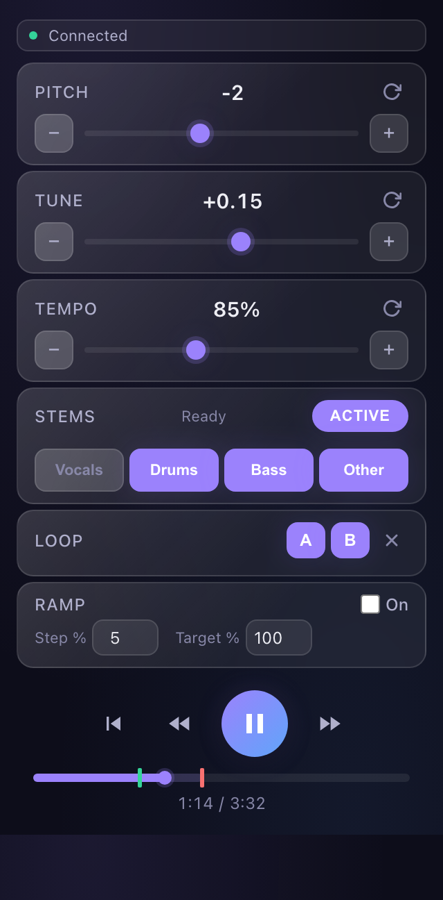

<p align="center">
  
</p>

# Keyshift

Keyshift is a free, open source Chrome extension. It changes the pitch and tempo of the audio in any tab, independently, and splits songs into stems on your computer.

<p align="center">
  
</p>

Use it to play along with a song in your own key, slow down a hard part to learn it, or mute the vocals or bass to practice over the rest of the band.

## Install

Keyshift needs Chrome 116 or later, or another Chromium browser (Edge, Brave, Arc).

1. Download `keyshift-<version>.zip` from the [latest release](https://github.com/JordanCampbellDesign/keyshift/releases/latest) and unzip it.
2. Open `chrome://extensions` and turn on **Developer mode** (top right).
3. Click **Load unpacked** and choose the unzipped folder.
4. Pin Keyshift from the puzzle-piece menu so its icon stays in the toolbar.

To update, download the new zip, replace the folder, and click the reload button on the Keyshift card.

## Features

**Pitch and tempo**
- Shift pitch up to 12 semitones up or down. Fine tune to 0.01 of a semitone, for songs that aren't at A = 440 Hz.
- Change tempo from 25% to 250% without changing pitch.
- Works on any tab with sound. On sites with a standard audio or video player (YouTube, SoundCloud, Bandcamp, and most others), tempo, looping, and the transport controls work too.

**Practice tools**
- Set loop points A and B and repeat a section.
- Speed ramp: start slow, and Keyshift raises the tempo a little on each pass until it reaches your target.
- A timeline shows the loop. Click it to jump.
- Keyshift remembers pitch, tuning, and tempo for each page.

**Stems**
- Split a song into vocals, drums, bass, and other with [Demucs](https://github.com/facebookresearch/demucs), running on your computer in WebAssembly. Nothing is uploaded.
- Turn any stem on or off while it plays. Pitch shifting still applies.
- On sites that don't expose an audio file (for example Spotify), click **Record**, play the part you want, then click **Stop**. Keyshift separates the recording.
- Separated songs are cached, so the second time is instant.

## Keyboard shortcuts

In the popup:

| Action | Keys |
|---|---|
| Pitch up or down 1 semitone | ↑ ↓ |
| Fine tune up or down 0.1 | ⇧↑ ⇧↓ |
| Tempo down or up 5% | [ ] |
| Play or pause | Space |
| Set loop point A or B | A, B |
| Clear the loop | Esc |
| Go to the start | 0 |
| Reset pitch, tuning, and tempo | R |

Anywhere in Chrome, while Keyshift is connected to a tab:

| Action | Keys |
|---|---|
| Pitch up or down 1 semitone | ⌥↑ ⌥↓ |
| Tempo up or down 5% | ⌥. ⌥, |

Change the global keys at `chrome://extensions/shortcuts`.

## How it works

- Keyshift captures the tab's audio with `chrome.tabCapture` and plays it through an AudioWorklet that shifts pitch with [SoundTouch](https://www.surina.net/soundtouch/).
- Tempo uses the page player's own `playbackRate`, which keeps pitch. When a page has no player element, the worklet slows the live audio instead. In that mode the audio falls behind, so Keyshift can only slow down, and **Resync** catches up.
- Chrome only allows captured audio in an offscreen document, so the audio graph lives in `offscreen.js`. The popup, service worker, and page script send it messages.
- Stem separation runs the Hybrid Transformer Demucs model (4 stems) in a Web Worker. The first run loads the 78 MB model from the extension into IndexedDB.

## Privacy and security

Keyshift has no server and no analytics. Audio stays on your computer. The only network request it makes is to download a page's audio file for stem separation, and it asks for access to that site first. See [SECURITY.md](SECURITY.md) for details.

## Build from source

```bash
git clone https://github.com/JordanCampbellDesign/keyshift.git
```

Load the `extension` folder with **Load unpacked**. There is no build step. `scripts/package.sh` builds the release zip. See [CONTRIBUTING.md](CONTRIBUTING.md) for debugging tips.

## Credits

Pitch shifting uses [SoundTouch JS](https://github.com/cutterbl/SoundTouchJS). Stem separation uses [Demucs](https://github.com/facebookresearch/demucs) by Meta AI Research, through [free-music-demixer](https://github.com/sevagh/free-music-demixer) and [demucs.onnx](https://github.com/sevagh/demucs.onnx) by Sevag Hanssian. See [THIRD_PARTY_NOTICES.md](THIRD_PARTY_NOTICES.md).

## License

[MIT](LICENSE), except the files listed in [THIRD_PARTY_NOTICES.md](THIRD_PARTY_NOTICES.md).
